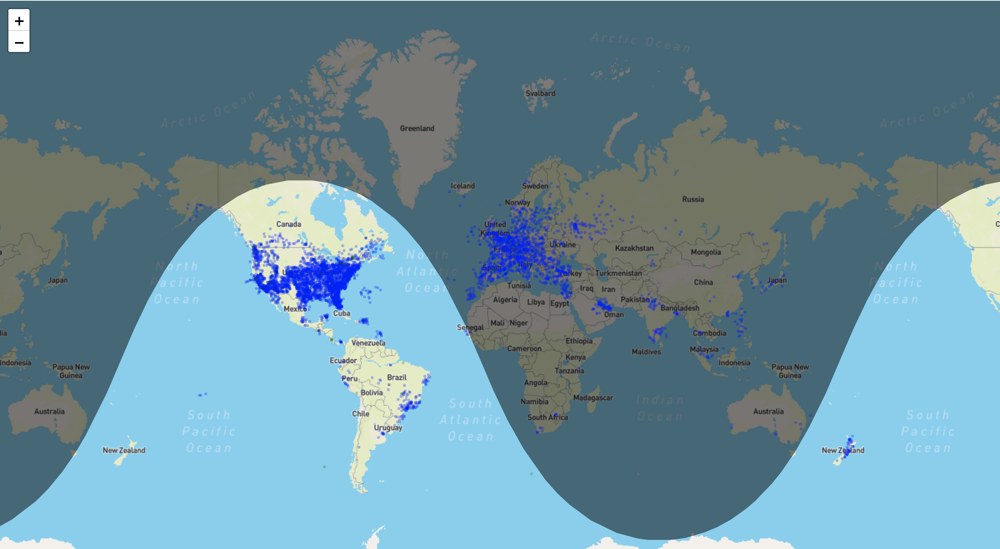

# Viz Opensky

## 项目介绍

这个项目是我用来可视化opensky api。显示此时此刻在天空中飞机的数量以及地点。这个项目主要受启发于此项目`https://github.com/jwasilgeo/leaflet-experiments`，我的主要工作是理解并简化其项目，当然实现的功能也更少了。也推荐大家去看他的项目。

## 项目Demo

阴影部分显示的此时此地为黑夜，非阴影部分显示此时此地为白天。蓝色的点代表着此时某一点上空的的飞机。

如果继续放大，我可以看到地图布满了飞机，黄色飞机的角度代表此时飞机正在飞行的方向。绿色的飞机则代表着此时此刻飞机并没有起飞。

## 可改进地方

- [ ] 增加一个搜索栏（与机场有关）
- [ ] 触碰到一个飞机的话，显示此飞机有关信息
- [ ] 根据国家来选择显示的飞机数量

## 备忘录

-  使用这个`https://opensky-network.org/api/states/all?lamin=41.2632185&lomin=-5.4534286&lamax=51.268318&lomax=9.8678344`，能返回在法国上空的数量。

- `countries_bbox.json`包含所有国家的边界地标

